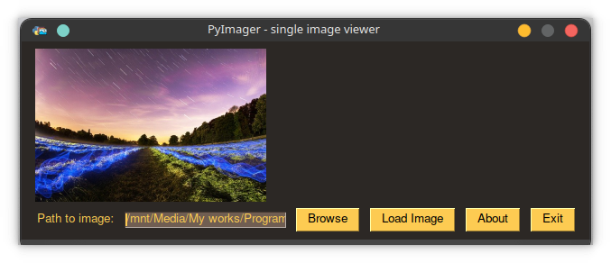
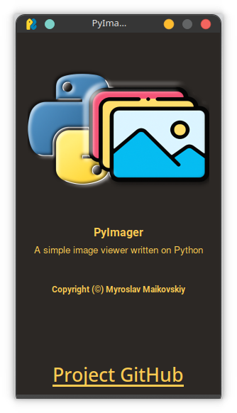
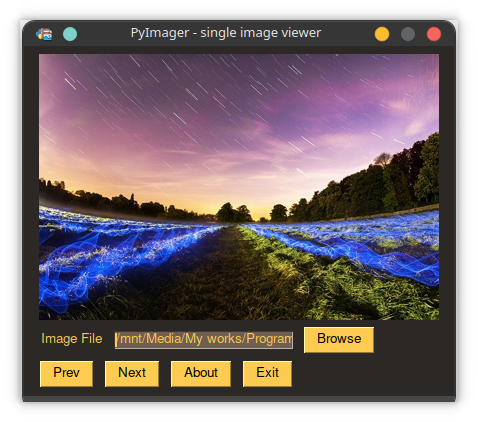

# PyImager
A simple imager viewer written on Python.

# About

Image viewer written on Python. Supports: Image viewing more than 13 formats, Including EPS, BMP, ICNS, ICO, JPEG, JPEG2000 and more!

# Some screenshots

# Installation

**NOTE!**
Pre-builded binaries only for Windows!. On Linux and MacOS, you need to download and run .py files!

**NOTE2!**
You need to install Python and pip (Also, add Python to PATH) to work correctly!
More information: [Here](https://www.howtogeek.com/197947/how-to-install-python-on-windows/)

# On Windows:
1. Download .exe installer from Releases tab.
2. Open and install it.
3. Navigate to installation directory (Default is: C:\Program Files (x86)\MyroslavMay\PyImager) and run: "pip install -r requiements.txt".
4. After installing run commands from "windows.bat"
5. Run the program and activate with PySimpleGUI key.
6. Hooray! You installed it!

# On Linux and MacOS

**First install Python and pip**
On Linux, you need to search in you package manager. On MacOS: [Install PIP](https://stackoverflow.com/questions/17271319/how-do-i-install-pip-on-macos-or-os-x), [Install Python](https://diveintopython.org/learn/install/mac).

# Downloading files on Linux and MacOS

1. Go to releases tab, and search for zip or tar.gz archive.
2. Extract it anywhere.
3. Run it with "python single-image-viewer.py" or "python3 single-image-viewer.py".
4. Hooray! You installed it!
